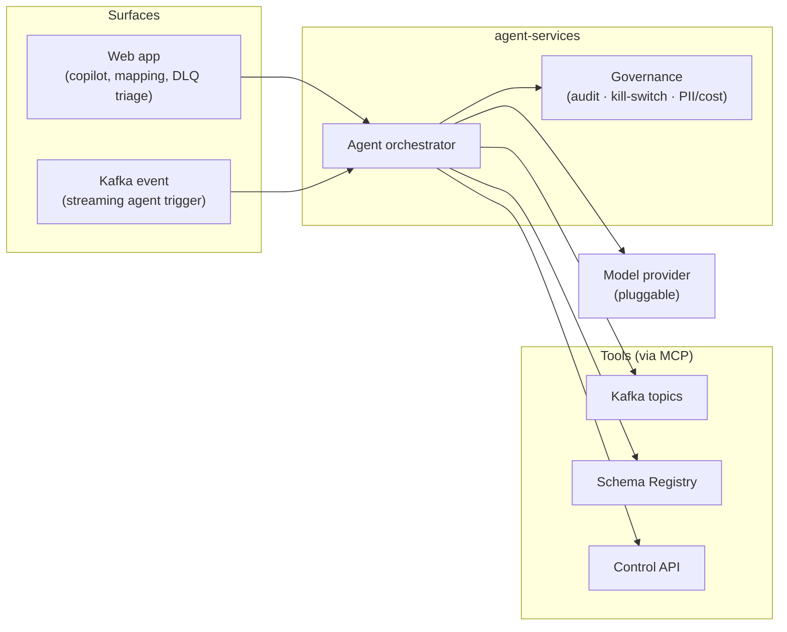

# Agent services (AI assist layer)

## Purpose

A model-provider-neutral AI layer that accelerates the work product teams do on the platform — authoring transforms, mapping fields, and recovering from failures — and exposes platform data to agents over a standard protocol. Rationale and scope are recorded in [ADR-0004](../decisions/0004-agentic-capabilities.md).

## Capabilities

1. **NL → Flink SQL authoring copilot.** Turns a natural-language description plus the source/target schemas into candidate [Flink SQL](./transform-engine.md). The user reviews and edits; nothing activates without explicit confirmation (PRD AC-11). Differentiator: a copilot that *writes and edits* the transform, not just explains it.
2. **Schema-registry-aware field mapping.** Reconciles fields between a source schema and a target schema (from the [Schema Registry](./schema-registry.md)) and from sampled payloads, suggesting the mapping and the `SELECT`/transform that realizes it.
3. **DLQ triage & auto-remediation.** Inspects dead-letter records, explains the root cause (schema mismatch, null/shape error, downstream rejection), and proposes a remediation — a transform/schema fix and a scoped replay plan. The fix is proposed; a human applies it.
4. **AI inference functions in Flink SQL.** Model inference callable from a transform as SQL functions (classification, sentiment, embedding, PII redaction) so model-backed enrichment stays in the pipeline.
5. **Event-driven streaming agents.** Agents that observe a stream, reason, and act through tools — for monitoring, enrichment, or routing — triggered by Kafka events.
6. **Agent governance.** Audit of every AI-assist action, a kill-switch, model-provider neutrality, and PII + cost controls.

## Behaviour

Topics and the schema registry are exposed to agents as **MCP** (Model Context Protocol) tools, with RBAC and audit, so both in-app copilots and external agents reason over fresh platform context through one interface.

## Dependencies

- A pluggable **model provider** (the platform is provider-neutral; no single vendor is assumed).
- [Transform engine](./transform-engine.md) — the target of authoring/mapping output and the host of in-SQL inference functions.
- [Schema Registry](./schema-registry.md) — source of truth for mapping suggestions.
- [Observability API](./observability.md) — DLQ and trace data for triage.
- [Control API](./control-api.md) — to read configuration and stage proposed changes (never to auto-activate).

## Known limitations

- AI proposals are **advisory** — activation of a transform or application of a fix requires explicit human confirmation.
- Inference is rate- and cost-controlled; PII handling follows the governance rules in [ADR-0004](../decisions/0004-agentic-capabilities.md).

## Market context

The agentic feature set is shaped by the current integration-platform market. In-SQL model inference, in-engine anomaly detection, event-driven "streaming agents", and MCP-exposed context are converging across major streaming platforms — this design matches that baseline. The clearest differentiation is in three areas where the field is weak: **NL→SQL authoring that writes the transform**, **schema-registry-aware field mapping**, and **AI dead-letter triage & remediation**. Those are prioritized here.
