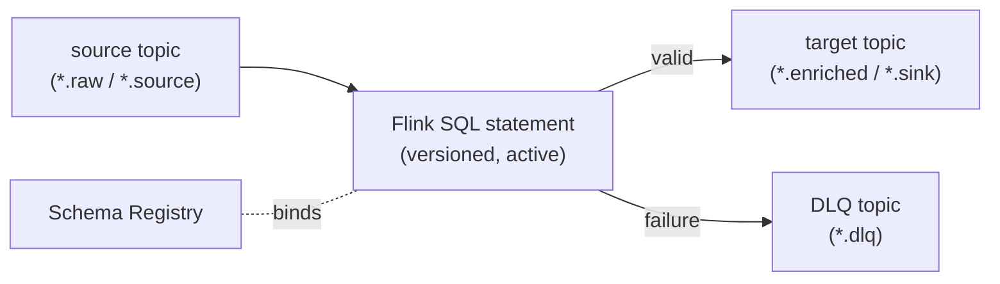

# Transform engine (Apache Flink SQL)

## Purpose

The single runtime that takes events from source topics, validates and reshapes them, and emits enriched events (or DLQ failures). Transformations are expressed as **Apache Flink SQL** — see [ADR-0002](../decisions/0002-flink-sql-as-transformation-engine.md) for why Flink SQL replaced the earlier JSONata worker.

## Behaviour

A **transform** is a versioned Flink SQL statement bound to a source stream and a target stream. The runtime:

1. Defines Flink tables over the source and target topics using Schema-Registry-aware formats (Avro/JSON Schema/Protobuf), per the [topic convention](../../reference/topic-naming.md).
2. Executes the active SQL statement — field mapping, filtering, joins, windowed aggregation, and stateful enrichment are all in scope.
3. Validates output against the destination schema and produces to the configured `targetTopic` (e.g. `*.enriched`).
4. On transform or validation failure, writes the record to the integration's DLQ (`<source>.dlq` or a configured failure queue) with context headers (`x-request-id`, `x-dlq-reason`).
5. Propagates correlation/request IDs end-to-end for tracing.



### Example transform

```sql
-- map and enrich orders; pin to schema versions at deploy time
INSERT INTO `orders_enriched`
SELECT
  id            AS order_id,
  customer.id   AS customer_id,
  UPPER(status) AS status,
  amount * fx_rate AS amount_eur,
  PROCTIME()    AS processed_at
FROM `orders_raw`
WHERE amount IS NOT NULL;
```

### AI inference in SQL

Model inference is callable from within a transform as SQL functions (e.g. classification, embedding, PII redaction), so enrichment that needs a model stays in the pipeline rather than a side service. These functions are provided by the [agent-services](./agent-services.md) layer and are model-provider-neutral (see [ADR-0004](../decisions/0004-agentic-capabilities.md)).

## Lifecycle & control

- The [Control API](./control-api.md) stores transform versions and binds them to topics (`FlinkSqlTransform`, status `draft|active|deprecated`). The transform runtime deploys the active statement per pipeline and redeploys on change.
- Versions are immutable; rollouts are atomic with rollback to the previous active version.
- A **dry-run** validates a draft against sample input and previews output before activation (`POST /api/workspaces/:id/flink-transforms/:id/validate`).
- Secrets (e.g. credentials for inference providers) are injected via secure config, never baked into images.

## Dependencies

- Apache Flink (cluster or SQL Gateway) as the execution substrate.
- Schema Registry for table formats and output validation.
- Kafka for source/target/DLQ topics.
- Control API for versioned transform configuration.

## Operational expectations

- Deploy per environment (dev/test/prod) with least privilege: read source, write enriched/dlq for the workspace.
- Observability: throughput, consumer lag, transform error rate, DLQ rate; structured logs with request/topic metadata (see [observability](./observability.md)).
- Health/backpressure: report readiness when statements are deployed and source/sink connections are live; pause on repeated failures.

## Known limitations

- Stateful queries (joins/windows) require state backend sizing and checkpointing config; the platform sets sane defaults per environment.
- Heavy AI inference in-SQL is rate- and cost-controlled (see [ADR-0004](../decisions/0004-agentic-capabilities.md)).
