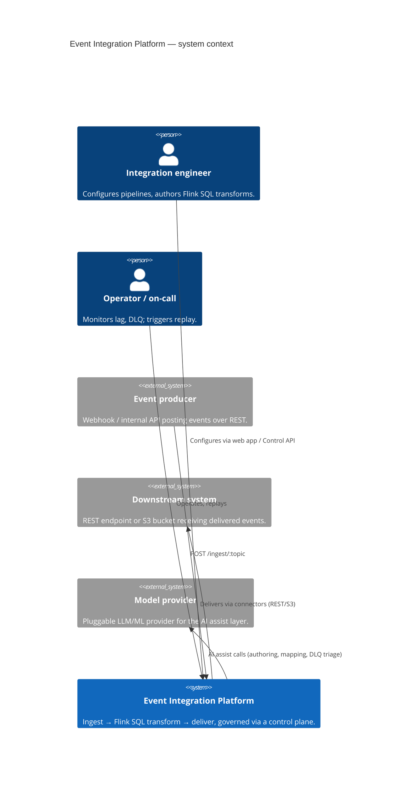
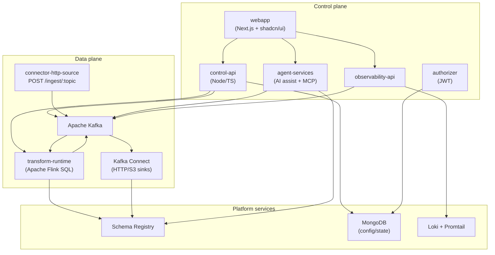

# Architecture overview

## Purpose

Describe the high-level architecture and the principles behind it. Component deep-dives live under [`components/`](./components/); cross-cutting decisions under [`decisions/`](./decisions/).

## Principles

- **Configuration over code** — product teams own transforms (Flink SQL) and config, not deployments.
- **Kafka-native, internal-only** — Kafka is never externally exposed ([ADR-0005](./decisions/0005-kafka-internal-only.md)).
- **Single transformation runtime** — Apache Flink SQL ([ADR-0002](./decisions/0002-flink-sql-as-transformation-engine.md)).
- **Fail-fast & observable** — early validation, DLQ on failure, end-to-end tracing.
- **Composable** — connectors, transforms, and AI assistance are independent parts.

## System context (C4 L1)

## Containers (C4 L2)

## Layers

### Kafka platform layer
Apache Kafka (self-hosted), Schema Registry, and Kafka Connect. Deployed via Docker Compose (local) and Kubernetes (prod). Topics follow the [naming convention](../reference/topic-naming.md); raw, enriched, and DLQ variants are first-class.

### Transformation
The **transform runtime** executes versioned **Flink SQL** statements bound to source/target topics — field mapping, joins, windows, and stateful enrichment — validating output against registered schemas and writing failures to the DLQ. See [transform-engine](./components/transform-engine.md) and [ADR-0002](./decisions/0002-flink-sql-as-transformation-engine.md).

### Control plane
The [Control API](./components/control-api.md) manages workspaces, pipelines, transforms, topics, clients, and connections (MongoDB-backed; KafkaJS admin for broker operations). The [web app](./components/webapp.md) is the operator surface. The [authorizer](./components/authorizer.md) issues JWTs.

### Connectors
[Kafka Connect](./components/connectors.md) is the connector runtime; the repo ships HTTP source/sink services built on `connector-core`. Delivery targets REST and S3.

### AI assist layer
[agent-services](./components/agent-services.md) provides NL→Flink-SQL authoring, schema-registry-aware field mapping, DLQ triage & remediation, in-SQL inference functions, and event-driven streaming agents — exposing topics and the schema registry to agents over MCP. See [ADR-0004](./decisions/0004-agentic-capabilities.md).

### Observability
[observability-api](./components/observability.md) serves workspace-scoped logs (Loki), metrics (Kafka admin + MongoDB), and per-message traces keyed by `x-request-id`.
